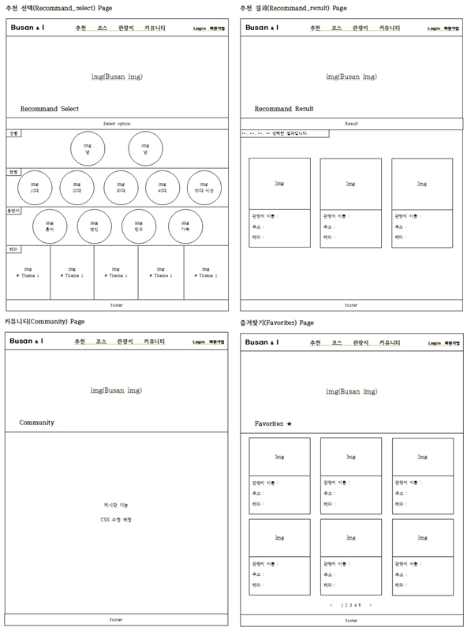

# :pencil: Busan for U 
>부산 여행지 추천 사이트  
>시연영상 : https://youtu.be/3TkvZLZpWAQ

</br>

## 1. 개요
사용자가 연령, 동반자, 테마 등을 선택하여 콘텐츠 기반 필터링 (Content based filtering) 추천 모델을 통해 사용자에게 맞는 부산 관광 명소를 추천해 주는 여행지 추천 사이트

</br>

## 2. 제작 기간 & 참여 인원
- 2022년 05월 04일 ~ 2022년 06월 15일
- 팀 프로젝트 6명, 프론트엔드 담당

</br>

## 3. 사용 기술
#### `Back-end`
  - Python
  - Django
  - Django Rest Framework + JWT
  - AWS RDS(MySQL)
#### `Front-end`
  - Vue.js 2

</br>

## 4. 와이어 프레임





</br>

## 5. 핵심 기능
 * Knox를 이용해 Token 발급. Token을 통한 사용자 Login 인증 정보 확인.
 * 콘텐츠 기반 필터링 (Content based filtering) 추천 모델을 통해 추천 여행지 출력.
 * Vue.js의 트랜지션, 모달 적용.
 * 게시물은 로그인 하지 않은 유저도 보는 것은 가능하지만 수정과 삭제는 로그인한 유저만 가능.

<details>
<summary><b>핵심 기능 설명 펼치기</b></summary>
<div markdown="1">

### 1. Knox를 이용해 Token 발급. Token을 통한 사용자 Login 인증 정보 확인
- **ReigstrationAPI, LoginAPI, UserAPI** :pencil: [코드 확인](https://github.com/HyoungMinSong/Busan/blob/fe870c2f20c092db402e932b036c9741f9edfb11/busanpro5/users/views.py#L10)
  - ReigstrationAPI : Knox를 이용해 가입시 유저 Token을 부여한다.
  - LoginAPI : 이메일 아이디와 비밀번호로 로그인하며, 로그인시 Token이 발급된다.
  - UserAPI : User Token으로 인증된 유저의 아이디와 이름을 확인한다.

</br>

-  **Logout**
   -  Logout 기능의 경우 Knox를 이용하며, 발급된 Token을 폐기
  
</br>

### 2. 콘텐츠 기반 필터링 (Content based filtering) 추천 모델을 통해 추천 여행지 출력.
- **Process**
 - 각 단계별로 선택된 변수를 포함한 여행지 리스트 간의 코사인 유사도를 계산하고 추천 리스트를 분류하여 최종 추천 여행지를 출력.
 
</br>

### 3. Vue.js의 트랜지션, 모달 적용.
- **Modal** :pencil: [코드 확인](https://github.com/HyoungMinSong/Busan/blob/master/busan-vue/src/components/ModalView.vue)
  - Vue.js의 기능인 모달 적용.

</br>

- **Transition** :pencil: [코드 확인](https://github.com/HyoungMinSong/Busan/blob/fe870c2f20c092db402e932b036c9741f9edfb11/busan-vue/src/App.vue#L111)
  - Vue.js의 기능인 트랜지션 적용.

</br>

### 4. 게시물은 로그인 하지 않은 유저도 보는 것은 가능하지만 수정과 삭제는 로그인한 유저만 가능.
- **BoardAPI, BoardDetailAPI** :pencil: [코드 확인](https://github.com/HyoungMinSong/Busan/blob/fe870c2f20c092db402e932b036c9741f9edfb11/busanpro5/boards/views.py#L9)
  - IsAuthenticatedOrReadOnly를 통해서 로그인 하지 않아도 게시물을 읽을 수는 있다. 하지만 새로운 게시물을 작성할 수는 없다.
  - IsOwnerOrReadOnly를 통해서 로그인 하지 않은 유저도 보는 것은 가능하지만 수정과 삭제는 로그인한 유저만 가능하다.

</div>
</details>

</br>

## 6. 트러블 슈팅
<details>
<summary>이미지 파일 접근 오류 </summary>
<div markdown="1">

  - 에러
    - 이미지 파일 이름과 Json으로 보내주는 이미지 파일 이름 한글 표기법이 달라 생기는 문제.
    - APEC나루공원이 ```APEC%EB%82%98%EB%A3%A8%EA%B3%B5%EC%9B%90.jpeg```와 ```APEC%E1%84%82%E1%85%A1%E1%84%85%E1%85%AE%E1%84%80%E1%85%A9%E1%86%BC%E1%84%8B%E1%85%AF%E1%86%AB.jpeg```로 각각 다르게 표기되어 접근이 오류가 남.
  - 해결
    - 파일 이름 변경으로 해결.

</div>
</details>

<details>
<summary>Vue Style 중복 에러</summary>
<div markdown="1">
  
  - 에러
    - 각각 담당했던 부분의 style을 scoped를 적용해서 스타일이 현재 컴포넌트의 엘리먼트에만 적용되도록 했어야 하는데 scoped를 안걸고 해서 css가 합쳐져 다른 컴포넌트에 사이드 이펙트가 생긴 상황.
  - 해결
    -  이미 너무 많이 진행된 상태여서 사이드 이펙트가 생긴 상황에서 css 일부 수정.
  
</div>
</details>

<details>
<summary>로그인 에러</summary>
<div markdown="1">
  
  - 에러
    - 로그인 버튼이 작동 에러
  - 해결
    - Django server 두 대를 켜놓고 사용해서 생긴 오류. 프로세스 하나 죽이기.
  
</div>
</details>

<details>
<summary>Django DB 연결 오류</summary>
<div markdown="1">
  
  - 에러
    - 타임아웃 에러
  - 해결
    -  AWS RDS 보안 설정 추가
  
</div>
</details>
